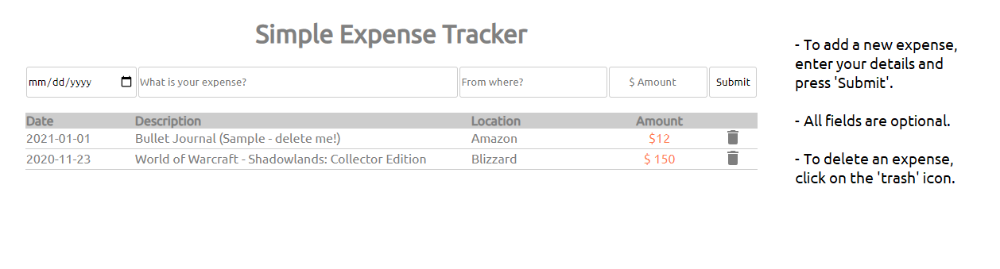

# A Simple Expense Tracker App

### A simple tracker that collects basic expense information.

#### Check it out [here](https://btarro.github.io/expense-tracker-app)

## Summary

This app was written using basic HTML, CSS, and JavaScript (no libraries). The focus of this project was to keep functions smaller and more intentional (be really good at one thing!). This app includes improvements over my previous projects by leveraging ternary operators and for-loops to lean into the 'DRY' concept where possible.

In the future I'd like to add:

- Editing of expenses
- Balance information
- Sorting

## Author

Bruce Tarro - Full Stack Developer [LinkedIn](https://www.linkedin.com/in/bruce-tarro/) | Personal Website - coming soon
